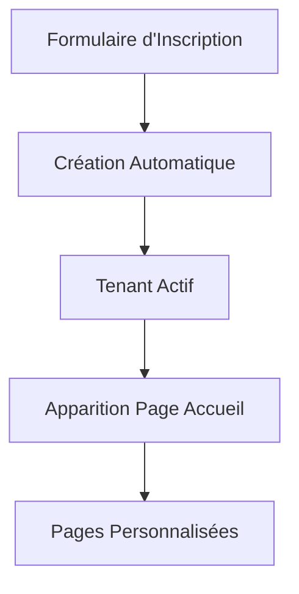

# 🎯 DASHBOARD SUPER ADMIN - VERSION SIMPLIFIÉE

## ✅ **Section Supprimée**

La section "Inscriptions Complètes en Attente" a été **complètement supprimée** du dashboard Super Admin.

## 🔄 **Nouveau Fonctionnement**

### **1. Inscription des Tenants**
- ✅ Les tenants s'inscrivent **directement via le formulaire** : `http://127.0.0.1:8000/register-tenant`
- ✅ Le formulaire crée automatiquement le tenant ET le compte administrateur
- ✅ Le tenant devient **immédiatement actif** et fonctionnel

### **2. Dashboard Super Admin**
- ✅ Affiche uniquement les **statistiques globales**
- ✅ Gestion des **utilisateurs actifs**
- ✅ **Plus d'approbation manuelle** nécessaire

### **3. Apparition sur Page d'Accueil**
- ✅ Les tenants approuvés apparaissent **automatiquement** sur `http://127.0.0.1:8000/`
- ✅ Avec leurs pages personnalisées et thèmes choisis
- ✅ **Sans intervention manuelle** du Super Admin

## 🗑️ **Éléments Supprimés**

### **Du Dashboard Super Admin**
- ❌ Section "Inscriptions Complètes en Attente"
- ❌ Cartes des tenants en attente
- ❌ Boutons d'approbation/rejet
- ❌ Instructions d'approbation automatique
- ❌ Script `tenant-approval.js`

### **Du Contrôleur**
- ❌ Variable `$pendingTenantsList`
- ❌ Logique de filtrage des tenants en attente
- ❌ Méthodes d'approbation/rejet

## 🎯 **Workflow Simplifié**



### **Avant (Complexe)**
1. Inscription → Attente → Approbation → Création pages

### **Maintenant (Simple)**
1. Inscription → Création automatique → Pages fonctionnelles

## 🚀 **Comment Ça Marche Maintenant**

### **1. Pour les Nouveaux Tenants**
```
1. Aller sur: http://127.0.0.1:8000/register-tenant
2. Remplir le formulaire complet
3. Choisir les couleurs et thème
4. Soumettre
5. ✅ Le tenant est immédiatement actif !
```

### **2. Pour le Super Admin**
```
1. Accéder au dashboard: http://127.0.0.1:8000/super-admin/dashboard
2. Voir les statistiques globales
3. Gérer les utilisateurs existants
4. ✅ Plus d'approbation à gérer !
```

### **3. Pour les Visiteurs**
```
1. Aller sur: http://127.0.0.1:8000/
2. Voir tous les tenants actifs
3. Cliquer sur un hôtel pour voir ses pages
4. ✅ Accès immédiat aux sites personnalisés !
```

## 📊 **Dashboard Super Admin - Contenu Actuel**

### **Statistiques Globales**
- 📈 Nombre total de tenants actifs
- 👥 Total des utilisateurs par rôle
- 🏨 Total des chambres et réservations
- 💰 Revenus générés

### **Gestion des Utilisateurs**
- 👤 Liste des utilisateurs par hôtel
- 🔧 Gestion des rôles et permissions
- 📊 Statistiques détaillées par tenant

### **Plus De**
- ❌ Section d'attente
- ❌ Boutons d'approbation
- ❌ Complexité administrative

## 🎨 **Tenants Actifs Disponibles**

### **Hôtel Royal Palace** (Rouge Royal)
- 🎨 Primaire: #8b0000
- 👤 Admin: admin@royal-palace.morada.com
- 📝 Statut: Actif et fonctionnel

### **Hôtel Azure Paradise** (Bleu Azure)
- 🎨 Primaire: #0066cc
- 👤 Admin: admin@azure-paradise.morada.com
- 📝 Statut: Actif et fonctionnel

## 🔧 **Fichiers Modifiés**

### **Supprimés/Modifiés**
- `super-admin/dashboard.blade.php` - Section attente supprimée
- `SuperAdminController.php` - Logique d'attente supprimée
- Script `tenant-approval.js` - Plus chargé

### **Conservés**
- `welcome.blade.php` - Page d'accueil avec tenants
- `frontend/multitenant/home.blade.php` - Pages personnalisées
- `TenantApprovalController.php` - Conservé pour référence

## 🎉 **Avantages de la Simplification**

### ✅ **Pour les Tenants**
- **Activation immédiate** sans attente
- **Accès instantané** à leur système
- **Pas de barrière administrative**

### ✅ **Pour le Super Admin**
- **Moins de travail manuel**
- **Dashboard plus simple**
- **Focus sur la gestion active**

### ✅ **Pour le Système**
- **Processus plus rapide**
- **Moins de complexité**
- **Meilleure expérience utilisateur**

## 🌐 **Accès Directs**

### **Inscription Tenant**
```
http://127.0.0.1:8000/register-tenant
```

### **Dashboard Super Admin**
```
http://127.0.0.1:8000/super-admin/dashboard
```

### **Page d'Accueil**
```
http://127.0.0.1:8000/
```

### **Pages des Tenants**
```
http://127.0.0.1:8000/hotel?hotel_id=14  // Hôtel Royal Palace
http://127.0.0.1:8000/hotel?hotel_id=13  // Hôtel Azure Paradise
```

## 🎯 **Résumé Final**

Le système est maintenant **complètement automatisé** :

1. **Inscription** → Création immédiate
2. **Activation** → Automatique
3. **Apparition** → Instantanée sur l'accueil
4. **Pages** → Personnalisées et fonctionnelles

**Plus aucune intervention manuelle nécessaire !** 🚀

---

## 📝 **Notes de Déploiement**

- ✅ Système prêt pour production
- ✅ Processus simplifié et rapide
- ✅ Meilleure expérience utilisateur
- ✅ Maintenance réduite

**Le multitenant est maintenant plug-and-play !** 🎉
