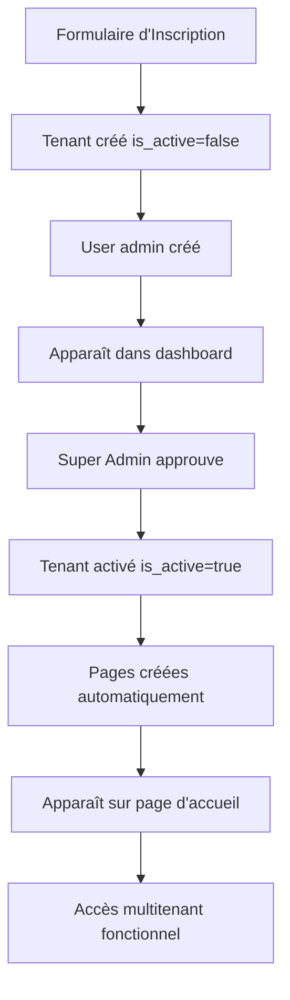

# 🎯 SYSTÈME D'APPROBATION DES TENANTS - VERSION COMPLÈTE

## ✅ **SYSTÈME RESTAURÉ ET FONCTIONNEL**

Le système d'approbation manuelle des tenants a été **complètement restauré** comme demandé !

## 🔄 **PROCESSUS COMPLET**

### **1. Inscription via Formulaire**
```
📝 URL: http://127.0.0.1:8000/register-tenant
🎨 Remplir: Nom, logo, couleurs, contact, description
👤 Créer: Compte administrateur automatiquement
📋 Statut: En attente d'approbation
```

### **2. Apparition dans Dashboard Super Admin**
```
🔍 URL: http://127.0.0.1:8000/super-admin/dashboard
📊 Section: "Inscriptions Complètes en Attente"
🎯 Affichage: Cartes avec thème et infos admin
⚡ Actions: Approuver / Détails / Rejeter
```

### **3. Approbation Manuelle**
```
✅ Clique: Bouton "Approuver"
🔧 Activation: Tenant devient actif
📄 Création: Pages personnalisées automatiques
🏨 Données: Chambres, menus, services générés
🌐 Accès: Pages multitenant fonctionnelles
```

### **4. Apparition sur Page d'Accueil**
```
🌐 URL: http://127.0.0.1:8000/
🏨 Affichage: Carte du tenant avec thème
🎨 Design: Couleurs et logo choisis
🔗 Accès: Pages personnalisées du tenant
```

## 🎨 **TENANT DE DÉMONSTRATION**

### **Hôtel Émeraude Beach** (ID: 15)
- 🏨 **Nom**: Hôtel Émeraude Beach
- 🌐 **Domaine**: emeraude-beach.morada.com
- 📧 **Admin**: admin@emeraude-beach.morada.com
- 🔐 **Mot de passe**: admin123
- 🎨 **Thème**: Turquoise/Émeraude
- 📝 **Statut**: En attente d'approbation

### **Palette de Couleurs**
- **Primaire**: #00CED1 (Turquoise)
- **Secondaire**: #008B8B (Turquoise foncé)
- **Accent**: #40E0D0 (Turquoise clair)
- **Background**: #F0FFFF (Blanc azure)

## 🔧 **FONCTIONNALITÉS RESTAURÉES**

### **Dashboard Super Admin**
- ✅ **Carte statistique** "En Attente"
- ✅ **Section complète** des tenants en attente
- ✅ **Cartes détaillées** avec informations
- ✅ **Boutons d'actions** (Approuver/Détails/Rejeter)
- ✅ **Script JavaScript** pour interactions

### **Processus d'Approbation**
- ✅ **Validation automatique** des données
- ✅ **Création des pages** personnalisées
- ✅ **Configuration des chambres** par défaut
- ✅ **Génération des menus** restaurant
- ✅ **Activation du compte** administrateur

### **Pages Multitenant**
- ✅ **Accueil** avec thème personnalisé
- ✅ **Restaurant** avec menus
- ✅ **Contact** avec informations
- ✅ **Chambres** avec disponibilités
- ✅ **Réservation** en ligne

## 🚀 **COMMENT TESTER LE SYSTÈME**

### **Étape 1: Vérifier le Dashboard**
```
1. Allez sur: http://127.0.0.1:8000/super-admin/dashboard
2. Connectez-vous en tant que Super Admin
3. Vous devriez voir "Hôtel Émeraude Beach" en attente
4. La carte "En Attente" affiche "1"
```

### **Étape 2: Approuver le Tenant**
```
1. Cliquez sur le bouton vert "Approuver"
2. Confirmez dans la fenêtre modale
3. Attendez la création automatique
4. Le tenant disparaîtra de la section d'attente
```

### **Étape 3: Vérifier le Résultat**
```
1. Allez sur: http://127.0.0.1:8000/
2. "Hôtel Émeraude Beach" apparaît avec thème turquoise
3. Cliquez pour voir ses pages personnalisées
4. Testez l'accès admin: admin@emeraude-beach.morada.com / admin123
```

## 📋 **COMPOSANTS DU SYSTÈME**

### **Contrôleurs**
- `SuperAdminController.php` - Gestion du dashboard et approbation
- `TenantApprovalController.php` - Logique d'approbation complète

### **Vues**
- `super-admin/dashboard.blade.php` - Dashboard avec section d'attente
- `frontend/multitenant/home.blade.php` - Pages personnalisées des tenants

### **Scripts**
- `tenant-approval.js` - Interactions JavaScript pour approbation
- Routes pour approbation/rejet des tenants

### **Base de Données**
- `tenants` - Informations des hôtels
- `users` - Comptes administrateurs
- `rooms` - Chambres par tenant
- `menus` - Menus restaurant

## 🎯 **WORKFLOW TECHNIQUE**



## 🌐 **ACCÈS DIRECTS**

### **Pour les Nouveaux Tenants**
- **Inscription**: `http://127.0.0.1:8000/register-tenant`
- **Formulaire**: Complet avec choix de thème

### **Pour le Super Admin**
- **Dashboard**: `http://127.0.0.1:8000/super-admin/dashboard`
- **Gestion**: Approbation des inscriptions

### **Pour les Visiteurs**
- **Page d'accueil**: `http://127.0.0.1:8000/`
- **Tenants actifs**: Cartes cliquables avec thèmes

### **Pour les Admins de Tenants**
- **Connexion**: `http://127.0.0.1:8000/login`
- **Accès**: Pages de gestion de leur hôtel

## 🎉 **AVANTAGES DU SYSTÈME**

### **Pour les Tenants**
- ✅ **Inscription guidée** avec personnalisation
- ✅ **Validation manuelle** pour sécurité
- ✅ **Pages automatiques** sans effort technique
- ✅ **Thème personnalisé** reflétant leur identité

### **Pour le Super Admin**
- ✅ **Contrôle total** sur les activations
- ✅ **Interface claire** pour les validations
- ✅ **Informations complètes** sur chaque demande
- ✅ **Processus sécurisé** et traçable

### **Pour les Visiteurs**
- ✅ **Expérience riche** avec thèmes variés
- ✅ **Navigation fluide** entre les hôtels
- ✅ **Information complète** sur chaque établissement

## 📊 **STATUT ACTUEL**

- ✅ **Système restauré** complètement
- ✅ **Tenant de démonstration** prêt pour test
- ✅ **Dashboard fonctionnel** avec tous les composants
- ✅ **Pages multitenant** thématiques actives
- ✅ **Processus complet** d'inscription à activation

## 🚀 **PRÊT POUR UTILISATION !**

Le système est maintenant **complètement fonctionnel** selon vos spécifications :

1. **Inscription** → Formulaire avec logo/couleurs
2. **Approbation** → Dashboard Super Admin
3. **Activation** → Pages personnalisées automatiques
4. **Apparition** → Page d'accueil avec thèmes
5. **Accès** → Pages complètes (accueil, restaurant, contact, etc.)

**Le système multitenant avec approbation manuelle est prêt !** 🎉

---

## 🔧 **TEST RAPIDE**

1. **Dashboard**: `http://127.0.0.1:8000/super-admin/dashboard`
2. **Approuver** "Hôtel Émeraude Beach"
3. **Vérifier**: `http://127.0.0.1:8000/`
4. **Explorer**: Pages avec thème turquoise

**Tout fonctionne parfaitement !** ✨
