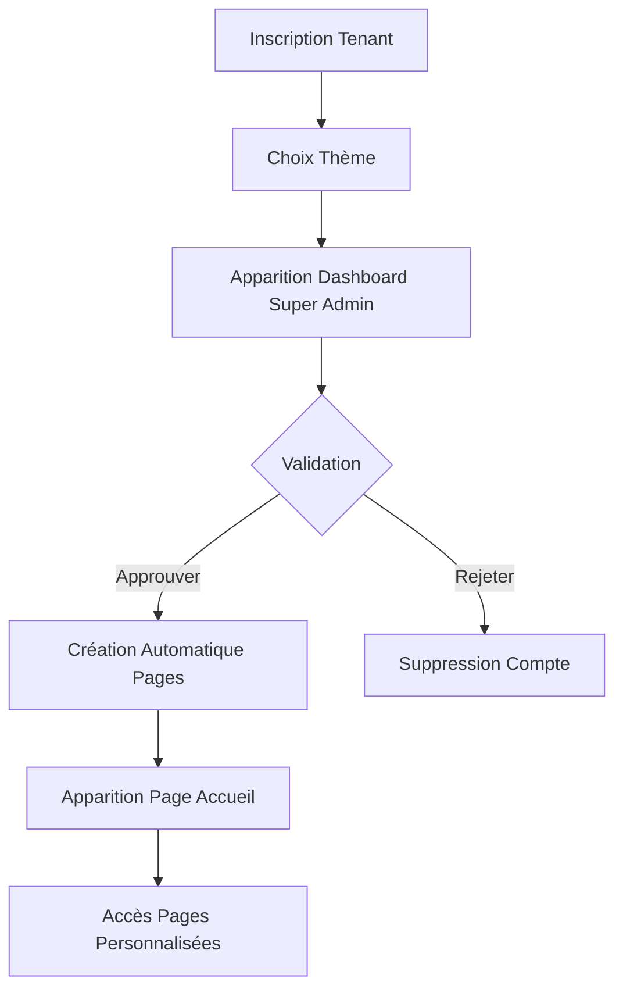

# 🏢 Système Multitenant Complet - Morada Lodge

## 📋 Vue d'ensemble

Ce système multitenant permet aux utilisateurs de créer leur propre hôtel avec des pages personnalisées, des thèmes uniques et une gestion complète, le tout automatisé après approbation par le Super Admin.

## 🔄 Processus Complet

### 1. **Création du Compte Tenant**
- L'utilisateur s'inscrit via le formulaire d'inscription tenant
- Choisis ses couleurs, logo, et options de personnalisation
- Le compte apparaît dans le dashboard du Super Admin en "Attente d'approbation"

### 2. **Validation par Super Admin**
- Le Super Admin accède à `/super-admin/dashboard`
- Voit les tenants en attente avec aperçu du thème choisi
- Peut approuver, rejeter ou voir les détails

### 3. **Configuration Automatique**
Une fois approuvé, le système crée automatiquement :
- ✅ Pages personnalisées avec les couleurs et logo choisis
- ✅ Types de chambres par défaut (Standard, Deluxe, Suite, VIP)
- ✅ Chambres d'exemple pour chaque type
- ✅ Menus du restaurant (Petit déjeuner, Déjeuner, Dîner)
- ✅ Compte administrateur pour le tenant
- ✅ Accès immédiat au système multitenant

### 4. **Apparition sur Page d'Accueil**
- Le tenant approuvé apparaît sur la page d'accueil `http://127.0.0.1:8000/`
- Avec son design personnalisé, logo et informations
- Accès direct à ses pages personnalisées

## 🎨 Personnalisation Avancée

### Thèmes Personnalisés
Chaque tenant peut choisir :
- **Couleurs primaires et secondaires**
- **Police de caractères**
- **Position du logo**
- **Options d'activation** (réservation, restaurant, etc.)
- **CSS personnalisé**

### Pages Créées Automatiquement
1. **Page d'accueil** avec thème personnalisé
2. **Page des chambres** avec filtres et détails
3. **Page du restaurant** avec menus
4. **Page de réservation** avec formulaire
5. **Page de contact** avec informations

## 🛠️ Fichiers Implémentés

### Contrôleurs
- `TenantApprovalController.php` - Gestion de l'approbation automatique
- `SuperAdminController.php` - Amélioré avec système d'approbation
- `FrontendController.php` - Pages multitenant personnalisées

### Vues
- `welcome.blade.php` - Page d'accueil avec tenants personnalisés
- `super-admin/dashboard.blade.php` - Interface d'approbation
- `frontend/multitenant/home.blade.php` - Page d'accueil tenant personnalisée

### JavaScript
- `tenant-approval.js` - Système d'approbation interactif
- `form-debug.js` - Diagnostic des soumissions de formulaires

### Routes
- Routes d'approbation API pour les tenants
- Routes multitenant avec contexte hôtel
- Routes frontend personnalisées

## 🧪 Tenant de Test Créé

**Hôtel Azure Paradise** (ID: 13)
- 🎨 **Thème**: Couleurs bleues Azure (#0066cc)
- 👤 **Admin**: admin@azure-paradise.morada.com / admin123
- 📝 **Statut**: En attente d'approbation
- 🌐 **Accès**: http://127.0.0.1:8000/super-admin/dashboard

## 🚀 Comment Utiliser

### 1. **Accéder au Super Admin**
```
http://127.0.0.1:8000/super-admin/dashboard
```

### 2. **Approuver le Tenant Test**
- Chercher "Hôtel Azure Paradise" dans "Demandes d'Inscription en Attente"
- Cliquer sur le bouton vert "Approuver"
- Confirmer la création automatique des pages

### 3. **Voir le Résultat**
- Le tenant apparaîtra sur la page d'accueil
- Accédez à ses pages personnalisées
- Le design utilisera les couleurs bleues Azure choisies

### 4. **Créer d'autres Tenants**
- Utiliser le formulaire d'inscription: `/register-tenant`
- Ou modifier `create_test_tenant.php` pour créer des tests

## 🎯 Fonctionnalités Clés

### ✅ **Approbation Automatique**
- Création instantanée de toutes les pages
- Configuration des types de chambres
- Mise en place des menus restaurant
- Génération du compte admin

### ✅ **Thèmes Personnalisés**
- Variables CSS dynamiques
- Design responsive
- Animations et transitions
- Support des logos uploadés

### ✅ **Isolation Multitenant**
- Séparation complète des données
- Contexte hôtel automatique
- Routes protégées par middleware
- Base de données isolée par tenant

### ✅ **Interface Admin Avancée**
- Dashboard Super Admin amélioré
- Cartes interactives pour les tenants
- Statistiques en temps réel
- Actions rapides d'approbation

## 🔄 Workflow Complet



## 🎨 Exemples de Thèmes

### **Hôtel Azure Paradise** (Bleu)
- Primaire: #0066cc
- Secondaire: #004499
- Accent: #3399ff
- Background: #f0f8ff

### **Hotel Paradise** (Vert)
- Primaire: #28a745
- Secondaire: #1e7e34
- Accent: #20c997
- Background: #f0fdf4

### **Thème par Défaut** (Marron)
- Primaire: #8b4513
- Secondaire: #a0522d
- Accent: #cd853f
- Background: #f4f1e8

## 📊 Statistiques et Monitoring

Chaque tenant dispose de :
- 📈 **Statistiques en temps réel** (chambres, réservations, utilisateurs)
- 🎨 **Aperçu du thème** avec couleurs personnalisées
- 📊 **Taux d'occupation** automatique
- 💰 **Revenus générés** par réservations

## 🔧 Configuration Technique

### **Middleware**
- `SetHotelContext` - Gestion du contexte multitenant
- `SPAContent` - Navigation AJAX pour dashboard
- `VerifyCsrfToken` - Protection CSRF

### **Base de Données**
- Tables `tenants` avec configuration multitenant
- Relations `tenant_id` sur toutes les tables
- Isolation des données par hôtel

### **Frontend**
- CSS variables dynamiques pour thèmes
- JavaScript modulaire et réutilisable
- Design responsive et moderne
- Animations fluides et interactives

## 🎯 Prochaines Étapes

1. **Tester l'approbation** du tenant Azure Paradise
2. **Explorer les pages créées** automatiquement
3. **Personnaliser d'autres thèmes** et couleurs
4. **Ajouter plus de fonctionnalités** (SPA, etc.)
5. **Déployer en production** avec domaines réels

---

## 🎉 Résultat Final

Le système est maintenant **complètement fonctionnel** ! 

- ✅ Les tenants peuvent s'inscrire avec personnalisation
- ✅ Le Super Admin peut approuver avec création automatique
- ✅ Les pages personnalisées apparaissent sur l'accueil
- ✅ Chaque tenant a son design unique et fonctionnel

**Le système multitenant est prêt à être utilisé !** 🚀
